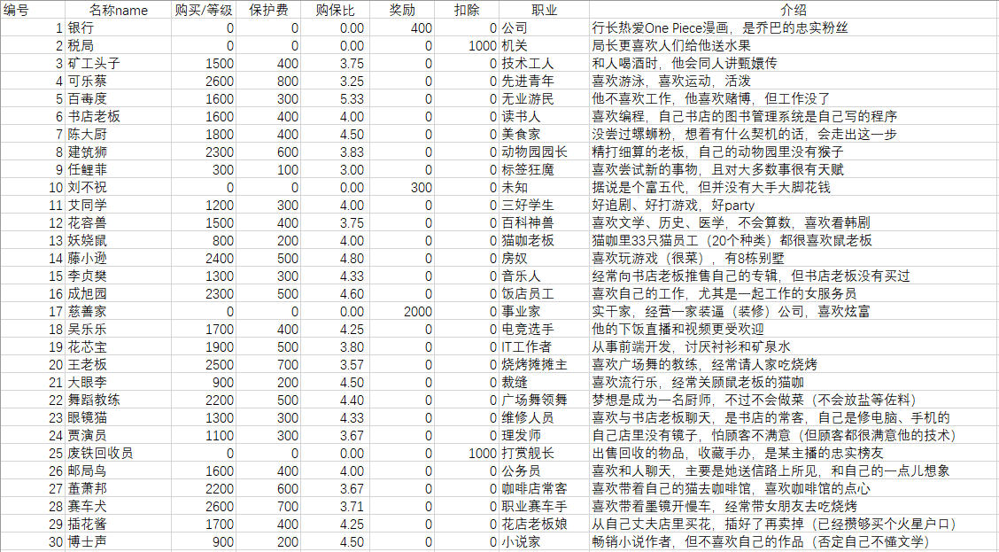
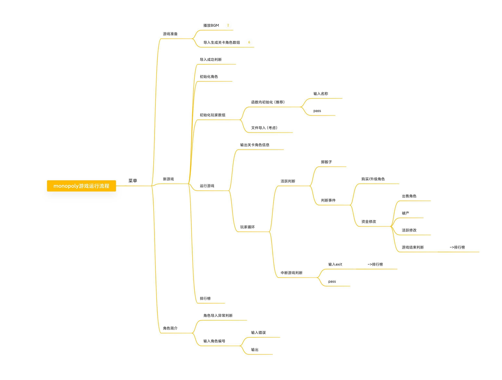
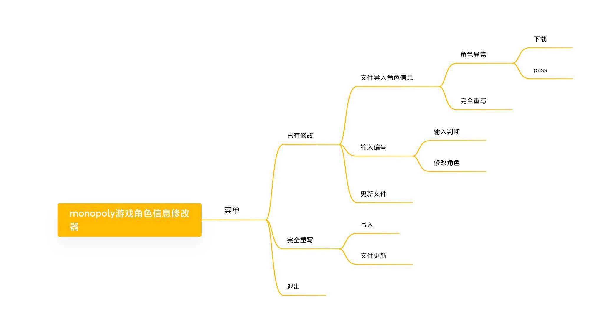

@[TOC](目录)
# 1 单词积累
## 1.1 文件/模块名
1. 大富翁：monopoly
2. 说明：elucidation
3. 导入：import
## 1.2 函数名
1. 导入：import
2. 初始化：initialize
## 1.3 变量名

1. 费用：expenses
2. 简介：introduction
3. 描述：description
4. 福利：bonus
5. 罚金：fine

# 2 游戏内容
## 2.1 玩法设定
### 2.1.1 银行
1. 发配游戏资金，初始资金建议：20000（单位：元）
2. 出售回收角色，以等级半价回收角色
3. 破产补偿，为破产玩家偿还额外的金额
4. 统计玩家资金
### 2.1.2 玩家数：2-6 人
1. 获得银行的起始资助
2. 通过骰子控制自己的前进步长
3. 通过银行购买角色和升级角色
4. 其他玩家通过自己角色地时，收取保护费
5. 到达其他玩家角色地时，缴纳保护费
6. 资金不够时，必须由银行回收角色以支付必要费用
7. 出售给银行自己不想要的角色
### 2.1.3 关卡与角色

## 2.1.4 游戏流程

# 3 角色修改器

## 3.1 修改器流程

